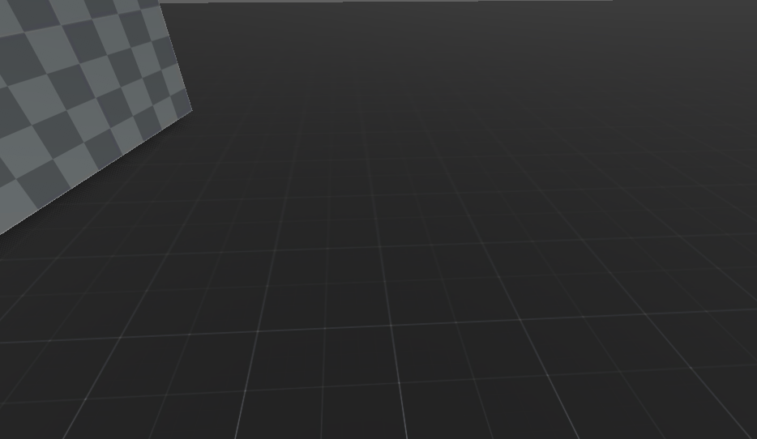

<p align="center">
  
</p>
<br>
<br>
<hr>
Easy to use First Person Movements for Godot 4
<br>
<br>
<p align="center">
  
</p>

### 1. Prerequisites:
**Godot Engine:** Download and install Godot 4. You can find it at godotengine.org.

**Git:** Ensure you have Git installed on your system.

### 2. Clone the Repository
Open your terminal or command prompt and run:


```bash
git clone https://github.com/ob-cell/First-Person-Movements-Godot.git
```
Alternatively, download the source as a ZIP file by clicking the green Code button at the top of this page.

### 3. Opening the Project
* Launch the Godot Project Manager.
* Click the Import button.
* Navigate to the folder where you cloned the repo and select the project.godot file.
* Click Import & Edit.
<br>
<br>
<hr>
<p align="center">
  
</p>
